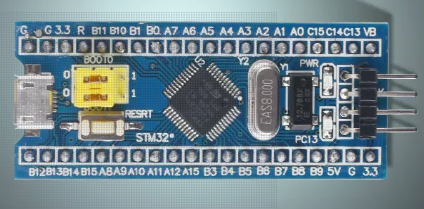
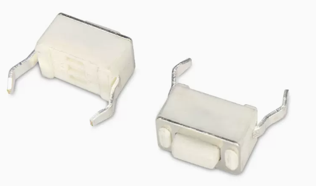
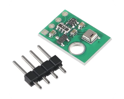
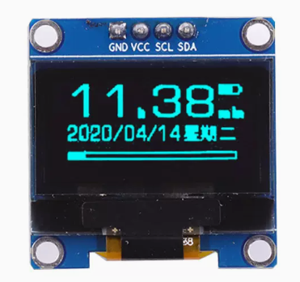
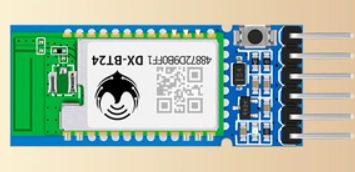
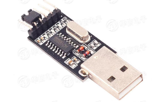
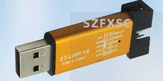
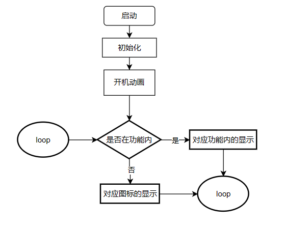
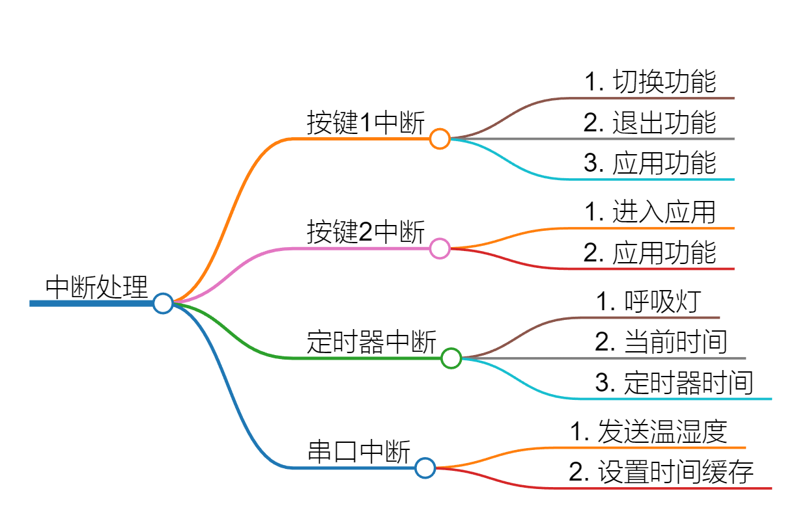

# 温湿度检测多功能开发模块

## 元器件清单

1. STM32F103C8T6单片机    
  
2. LED灯   
         
3. 按键   

4. 温湿度模块（AHT20）            

5. OLED屏幕（4pin+ssd1305）      

6. BLE低功耗蓝牙（BT24）    

7. 串口模块（USB to TTL）       

8. ST-LINK V2下载器        

9. 若干杜邦线（公对母）+ 一块面包板 

## 演示视频
<video width="320*2" height="240*2" controls>
  <source src="./video.mp4" type="video/mp4">
</video>

## 功能

1. 温湿度检测
2. 时钟
3. 计时器
4. 作者信息
* LED灯+按键
> LED: 呼吸灯   

> 按键1(PA4)：功能的切换/退出   

> 按键2(PA7): 功能的确定/使用   

## 代码逻辑

